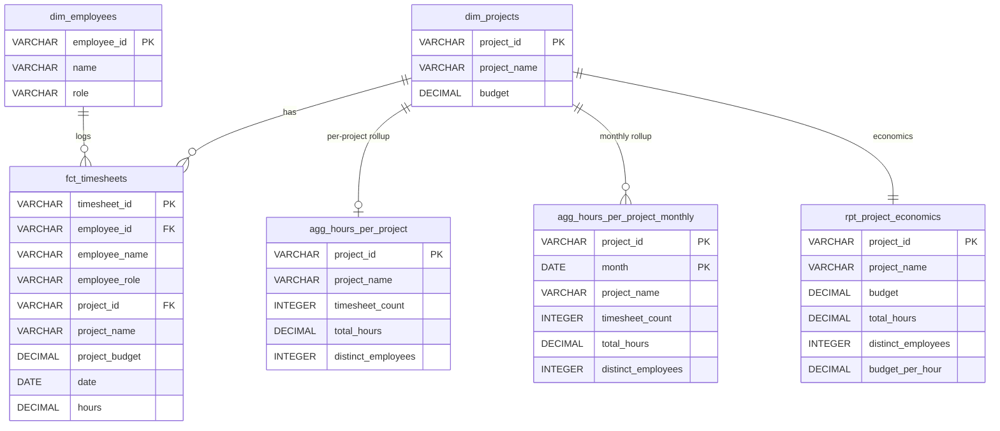

# dbt + DuckDB Timesheet Pipeline

A small but end-to-end data pipeline that ingests three imperfect source CSVs
(projects, employees, timesheets), validates them, and transforms them into
analysis-ready star-schema outputs in a DuckDB warehouse, orchestrated with dbt.

The pipeline follows a **raw → validated → transformed** flow, implemented as
four physical DuckDB schemas that mirror four dbt layers:

- `main_raw` — faithful VARCHAR copy of the CSVs (loaded by Python).
- `main_staging` — typed + deduped projections; single-source hard rejects dropped.
- `main_intermediate` — the one cross-source model; filters dangling FKs → accepted fact set.
- `main_marts` — clean, consumer-facing dims/fact/aggregate (contracts enforced).

> 🌐 **Live documentation site:** <https://emmver.github.io/dbt_pipeline/>
>
> The interactive project docs are generated with
> [**docglow**](https://github.com/docglow/docglow) (a next-generation dbt docs
> generator with column-level lineage, an ERD view, and column insights) and
> published to GitHub Pages from the `docs/` directory on the `main` branch.
> The site includes the full lineage graph (with column-level edges), an ERD
> diagram at `/erd`, per-model column docs, and all 19 tests. Regenerate
> locally with `.venv/bin/docglow generate --project-dir dbt --target-dir target
> --output-dir docs --enable-erd`.

## Repo map

| Path | Purpose |
|---|---|
| `data/*.csv` | Three source CSVs (projects, employees, timesheets). |
| `scripts/load_raw.py` | Raw loader: CSVs → `main_raw` (all VARCHAR, idempotent). |
| `dbt/` | dbt project (`dbt_project.yml`, `profiles.yml`, `models/`, `tests/`). |
| `dbt/models/staging/` | `stg_projects`, `stg_employees`, `stg_timesheets` + YAML. |
| `dbt/models/intermediate/` | `int_timesheets_validated` + YAML. |
| `dbt/models/marts/` | `dim_projects`, `dim_employees`, `fct_timesheets`, `agg_hours_per_project` + YAML. |
| `dbt/tests/generic/` | Custom tests: `hours_in_range`, `date_parseable`, `invalid_budget`, `unique_natural_key`. |
| `dbt/docs/schema_design.md` | Design notes: ER overview, DB-vs-pipeline enforcement table, assumptions. |
| `dbt/docs/er_diagram.mmd` | Mermaid ER diagram of `main_marts`. |
| `docs/` | Generated **docglow** docs site (published to GitHub Pages at <https://emmver.github.io/dbt_pipeline/>). |
| `warehouse/schema.sql` | Intended DDL (with FK / CHECK declared for design completeness). |
| `warehouse/dbt_pipeline.duckdb` | The live DuckDB warehouse. |
| `warehouse/outputs/` | Cleaned datasets + validation report (CSVs). |
| `README.md` | This file. |

---

## 1. Prerequisites & how to run

**Prerequisites**

- Python 3.10+ with `duckdb` installed in the project venv at `.venv/`.
- `dbt-duckdb` (dbt-Fusion CLI) installed in `.venv/` (invoked via `../.venv/bin/dbt`).
- Source CSVs present under `data/` (`projects.csv`, `employees.csv`, `timesheets.csv`).

**Run order** (from the repo root):

```bash
# 0. If a DuckDB UI/CLI is open, kill it first — it holds an exclusive lock
#    on warehouse/dbt_pipeline.duckdb and will block dbt.
pkill -f duckdb_cli

# 1. Load raw CSVs into DuckDB schema main_raw (all VARCHAR, idempotent)
.venv/bin/python scripts/load_raw.py

# 2. Build the dbt models (staging → intermediate → marts)
cd dbt
DBT_PROFILES_DIR=. ../.venv/bin/dbt run

# 3. Run tests (source tests on main_raw + mart grain tests)
DBT_PROFILES_DIR=. ../.venv/bin/dbt test
```

**Important notes**

- `DBT_PROFILES_DIR=.` is required because `profiles.yml` lives in the `dbt/`
  project directory, not in `~/.dbt/`.
- **Use `dbt run` + `dbt test` — not `dbt build`.** dbt-Fusion's `dbt build`
  skips downstream models when an upstream/source test errors, which would
  silently drop the mart builds. Running `run` then `test` keeps model
  materialization decoupled from test execution, so a hard-reject source test
  never prevents the marts from materializing.
- The DuckDB CLI lock caveat (`pkill -f duckdb_cli`) matters because any open
  UI holds an exclusive file lock on the warehouse.

---

## 2. Pipeline structure

### Layers, schemas, tags

One dbt layer → one DuckDB schema → one dbt tag (dbt prepends `main_` to the
configured schema name, hence `main_staging`, `main_intermediate`, `main_marts`):

| Layer | dbt tag | DuckDB schema | Materialization | Models |
|---|---|---|---|---|
| Raw | — | `main_raw` | table (Python) | `projects`, `employees`, `timesheets` |
| Staging | `staging` | `main_staging` | view | `stg_projects`, `stg_employees`, `stg_timesheets` |
| Intermediate | `intermediate` | `main_intermediate` | table | `int_timesheets_validated` |
| Marts | `marts` | `main_marts` | table | `dim_projects`, `dim_employees`, `fct_timesheets`, `agg_hours_per_project` |

### The 8 models / DAG flow

```
                       main_raw (Python load)
                  projects   employees   timesheets
                       |         |           |
              +--------+---------+-----------+-----+
              | stg_projects  stg_employees  stg_timesheets   (staging: typed, deduped,
              |     |             |             |              single-source hard rejects dropped)
              |     |             |             |
              |     |             +-----+-------+
              |     |                   |
              |     |        int_timesheets_validated          (intermediate: cross-source
              |     |                   |                       semi-join filters dangling FKs)
              |     |                   |
              +-----+-------------------+----+
                    |        |                |
              dim_projects  dim_employees   fct_timesheets      (marts: pure joins,
                    |            |                |                no filters, contracts)
                    +------------+----------------+
                                 |
                       agg_hours_per_project              (rollup by project_id)
```

### Where cleaning happens

- **Staging** does *single-source* cleaning (per dbt-Labs guidance that
  staging "should clean up or mitigate data issues that can't be fixed at the
  source"): type casting, dedup of exact duplicates (window `dup_rank`,
  rank-1 survivor flows onward), and removal of single-source hard rejects.
  In `stg_timesheets` these rejects are: missing `employee_id`, unparseable
  `date`, non-numeric/out-of-range `hours`. A deterministic md5 surrogate
  `timesheet_id` is added.
- **Intermediate** does the only *cross-source* cleaning:
  `int_timesheets_validated` semi-joins `stg_timesheets` to
  `stg_employees` / `stg_projects` and filters dangling FKs → the **accepted
  fact set**. No flags / status columns: cleaning is a `WHERE` filter.
- **Marts** are pure joins/aggregations on already-clean data — no filtering.

---

## 3. Validation approach

The pipeline does **not** tag rows with accepted/rejected/review flag columns.
Instead it **pinpoints** issues with source tests, **cleans** them with SQL
filters, and **guards** the outputs with a test layer. The
accepted/rejected/review classification is the *outcome* of those filters and
test severities — not a stored column.

### How it works (three layers)

1. **Pinpoint** — dbt **source tests on `main_raw`** flag every problem in
   the raw data the moment it lands. With `store_failures: true` (set
   project-wide), the offending rows of each test are written to the
   `main_dbt_test__audit` schema — this is the validation report.
2. **Clean** — staging and intermediate models drop bad rows with `WHERE`
   filters (no flag columns): staging dedups exact duplicates and removes
   single-source hard rejects (missing id, bad date, bad hours); the
   intermediate filters dangling foreign keys. Soft-issue rows (valid id,
   suspect attribute) are *kept*.
3. **Guard** — dbt tests on the **marts** assert the outputs are clean
   (`unique` PKs, `relationships` FKs), and `primary_key` constraints reject
   any bad insert at build time.

### Test severities

| Severity | Meaning | Examples |
|---|---|---|
| **error** | a HARD problem — the rows are rejected (filtered out) and the test fails the run | `unique` (duplicate ids), `not_null` (missing id), `hours_in_range`, `date_parseable`, `unique_natural_key`, `relationships` (dangling FK), mart `unique`/`relationships` |
| **warn** | a SOFT problem — the row is kept (review) and the test warns without failing the build | `not_null` on `project_name` / `name` / `role`, `invalid_budget` |

So: **rejected** = a row that fails an *error*-severity check (filtered out by
staging/intermediate); **review** = a row that fails a *warn*-severity check
(kept, flagged for a human); **accepted** = everything else, which flows to the
marts. Accepted tallies: **331 timesheets, 35 projects, 40 employees**.

### Validation output (a report, not a data product)

The validation output is **not** a pipeline model — it is two artifacts:

1. `main_dbt_test__audit.*` — the failing rows per test, regenerated each
   `dbt test` (populated by `store_failures: true`).
2. `warehouse/outputs/validation_issues.csv` — a human-readable summary (one row
   per check: `check_name`, `source_table`, `column`, `severity`, `status`,
   `failing_row_count`, sample values, `how_handled`).

### Issues found (from `warehouse/outputs/validation_issues.csv`)

| Check | Table | Severity | Status | Failing rows |
|---|---|---|---|---|
| `unique` | projects.project_id | error | rejected | 3 |
| `not_null` | projects.project_id | error | rejected | 1 |
| `unique` | employees.employee_id | error | rejected | 2 |
| `hours_in_range` | timesheets.hours | error | rejected | 5 |
| `unique_natural_key` | timesheets | error | rejected | 2 |
| `not_null` | timesheets.employee_id | error | rejected | 1 |
| `relationships` | timesheets.employee_id → employees | error | rejected | 2 |
| `relationships` | timesheets.project_id → projects | error | rejected | 2 |
| `not_null` | projects.project_name | warn | review | 1 |
| `invalid_budget` | projects.budget | warn | review | 3 |
| `not_null` | employees.name | warn | review | 1 |
| `not_null` | employees.role | warn | review | 1 |

---

## 4. Data model & schema

The full star schema lives in schema `main_marts`:

- `dbt/docs/er_diagram.mmd` — Mermaid ER diagram (embedded below).
- `warehouse/schema.sql` — the intended DDL (with PK / FK / CHECK declared for
  design completeness).
- `dbt/docs/schema_design.md` — design notes, column types, the full
  DB-vs-pipeline enforcement table, and assumptions.

### Entity-relationship diagram



**Summary:** a classic star schema with two 1-to-many relationships.

- `dim_projects` — 35 rows, PK `project_id`.
- `dim_employees` — 40 rows, PK `employee_id`.
- `fct_timesheets` — 331 rows, PK `timesheet_id` (md5 surrogate);
  FK `employee_id` → `dim_employees`; FK `project_id` → `dim_projects`;
  dimension attributes denormalized for query convenience.
- `agg_hours_per_project` — 21 rows, PK `project_id`, rollup by project.
- `agg_hours_per_project_monthly` — 72 rows, composite PK (`project_id`, `month`); monthly burn-down per project (time-trend insight).
- `rpt_project_economics` — 35 rows, PK `project_id`; per-project budget + hours + derived `budget_per_hour` (assumes budget ≈ labor cost; see model comment).

### DB-vs-pipeline enforcement split

| Check | Enforced where | Mechanism |
|---|---|---|
| **PK** (uniqueness + not-null) | DB (build time) | DuckDB `PRIMARY KEY` constraint on all 4 PK columns. Idempotent (no cross-table dep) → `CREATE OR REPLACE` re-runs succeed. |
| **FK** (referential integrity) | **Pipeline + test** (not DB) | `int_timesheets_validated` semi-join filter (prevention) + `relationships` tests (detection). A DB `FOREIGN KEY` breaks idempotent re-runs in DuckDB (dbt-duckdb #425). Declared in `schema.sql` as intended design only. |
| `hours` range, `date` validity, `budget` validity | Pipeline + test | Staging/intermediate filters + custom source tests. Intended `CHECK`s in `schema.sql`, not materialized. |
| Soft/review nulls (`name`, `role`, `budget`) | Test (warn) | Warn-severity `not_null`/`invalid_budget` tests. **No** DB `NOT NULL` — would hard-fail the build on intentionally-kept review rows. |
| Source dup/missing-id/bad-hours/dangling-FK | Source test + audit | Error-severity tests on `main_raw` + `store_failures` → `main_dbt_test__audit`. |
| `total_hours NOT NULL` (agg) | DB (build time) | Materialized `CHECK` constraint. |

---

## 5. Key design decisions

- **Validation = tests + a report, not a model.** Data quality is enforced by
  dbt tests (source tests pinpoint issues; mart tests guard the outputs) and
  `store_failures` writes the failing rows to `main_dbt_test__audit`. The
  human-readable summary is exported to `validation_issues.csv`. The dbt DAG
  therefore contains only analytical data products — the validation report is
  a side artifact, regenerated each run.
- **Cleaning in staging + intermediate; marts are pure.** Per dbt-Labs
  layering, source-level cleaning (dedup, type/range fixes) lives in staging,
  cross-source cleaning (dangling-FK filtering) in the one intermediate, and
  marts are pure joins/aggregations on already-clean data. Business logic stays
  separate from data-quality plumbing.
- **PK enforced by the database; FK enforced by the pipeline + tests.**
  `primary_key` constraints are materialized by DuckDB and block bad inserts at
  build time (and are idempotent on re-runs). Foreign keys are *not* DB
  constraints: in DuckDB a `FOREIGN KEY` prevents `CREATE OR REPLACE` of the
  referenced table on re-runs (dbt-duckdb #425), which would break idempotency.
  So FK integrity is enforced by the `int_timesheets_validated` semi-join
  filter (prevention) and `relationships` tests (detection). The intended FK is
  declared in `warehouse/schema.sql` as the design target.
- **Soft "review" rows are kept, not dropped.** A row with a valid key but a
  suspect attribute (null name/role, invalid budget) is retained in the
  dimension and surfaced by a **warn**-severity test, so an analyst can review
  it rather than silently losing data. A `NOT NULL` constraint isn't used
  here because it would hard-fail the build on those intentionally-kept rows.
- **Deterministic md5 surrogate `timesheet_id`.** The fact primary key is an
  md5 hash of the natural key (employee_id, project_id, date) — the grain is one
  timesheet per employee/project/day; `hours` is a measure, not part of the
  key. The hash is stable across re-runs and independent of source-row ordering.
- **Run with `dbt run` then `dbt test`, not `dbt build`.** In dbt-Fusion,
  `dbt build` skips downstream models when a source test errors, which would
  silently drop the marts. Running `run` then `test` keeps model materialization
  decoupled from test execution — the source tests detect bad data without
  blocking the clean marts from building.

---

## 6. Rerunnability

Idempotency is ensured end-to-end:

- `load_raw.py` uses `CREATE OR REPLACE TABLE` for the raw layer.
- All dbt models are `view` or `table` (CREATE OR REPLACE) via dbt materializations.
- **PK constraints are idempotent** — a `PRIMARY KEY` has no cross-table
  dependency, so the dim/fact tables can be CREATE-OR-REPLACEd on every run.
- **FK constraint was the one non-idempotent piece** — declared DB `FOREIGN KEY`
  prevents `CREATE OR REPLACE` of the dim while the fact references it, so it
  was reverted to pipeline + test enforcement. The intended FK remains in
  `warehouse/schema.sql`.
- `store_failures` audit tables are replaced on each `dbt test`.

**Verified:** three consecutive `dbt run`s all succeed 8/8 models. A fresh
`.venv/bin/python scripts/load_raw.py` → `dbt run` → `dbt test` cycle reproduces the same
accepted counts (331 / 35 / 40) every time.

---

## 7. How I'd improve / scale (with more time)

1. **Incremental / materialized models for large volumes.** All models are
   currently full-refresh `view`/`table`. For real volumes, switch the fact
   and aggregate to `incremental` (merge on `timesheet_id`) or a materialized
   view, with a sensible `unique_key`.
2. **A real orchestrator.** Wire `dbt run` + `dbt test` into dbt Cloud or
   Airflow with alerting on warn/error and routing of `store_failures` rows
   to an observability tool (Elementary / Monte Carlo) instead of the manual
   `dbt_test__audit` inspection.
3. **Target a warehouse with robust FK constraints** (Postgres / Snowflake) to
   get true build-time FK enforcement and drop the pipeline-only workaround.
4. **Snapshot / registry of review issues with aging.** Today review is
   warn-only with no aging. A snapshot table would enable age-based escalation
   (warn → error after N days unresolved) and SLA tracking.
5. **Versioned, contracted marts + dbt Mesh** for cross-team consumption
   (model versions, cross-project `ref()`s, clear ownership boundaries).
6. **CI on PRs.** A slim `dbt build --select state:modified+` (against a
   cached manifest) for fast feedback on changed models only, plus
   `dbt ci`-style freshness/contract checks.

---

## 8. Deliverables map

| Deliverable | Path |
|---|---|
| Raw loader | `scripts/load_raw.py` |
| dbt project config | `dbt/dbt_project.yml`, `dbt/profiles.yml` |
| Staging models | `dbt/models/staging/` |
| Intermediate model | `dbt/models/intermediate/int_timesheets_validated.sql` |
| Mart models | `dbt/models/marts/` |
| Custom tests | `dbt/tests/generic/` (`hours_in_range`, `date_parseable`, `invalid_budget`, `unique_natural_key`) |
| Source / model YAML | `dbt/models/staging/_sources.yml`, `_staging.yml`, `dbt/models/intermediate/_intermediate.yml`, `dbt/models/marts/_marts.yml` |
| ER diagram (Mermaid) | `dbt/docs/er_diagram.mmd` |
| **Live docs site (docglow)** | **<https://emmver.github.io/dbt_pipeline/>** (generated from `docs/` via [docglow](https://github.com/docglow/docglow)) |
| Intended schema DDL | `warehouse/schema.sql` |
| Design notes | `dbt/docs/schema_design.md` |
| Cleaned fact dataset | `warehouse/outputs/fct_timesheets.csv` |
| Cleaned aggregate (per-project) | `warehouse/outputs/agg_hours_per_project.csv` |
| Cleaned aggregate (monthly) | `warehouse/outputs/agg_hours_per_project_monthly.csv` |
| Project economics report | `warehouse/outputs/rpt_project_economics.csv` |
| Validation report | `warehouse/outputs/validation_issues.csv` (+ live `main_dbt_test__audit.*` tables in `warehouse/dbt_pipeline.duckdb`) |
| Live warehouse | `warehouse/dbt_pipeline.duckdb` |
| README | `README.md` (this file) |